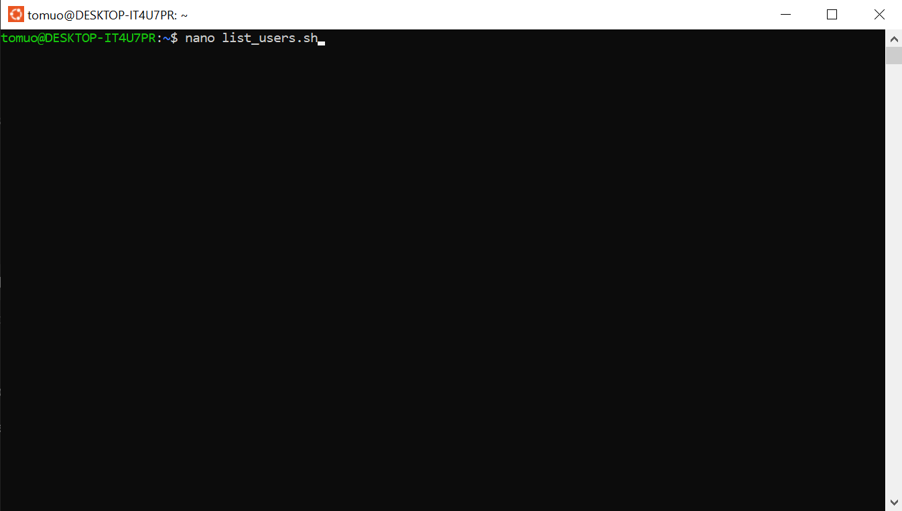
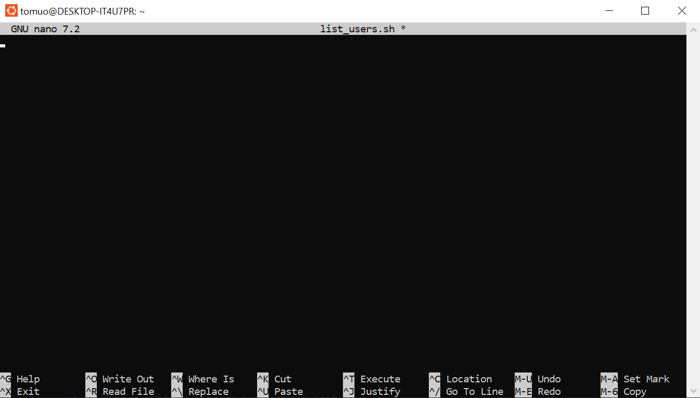
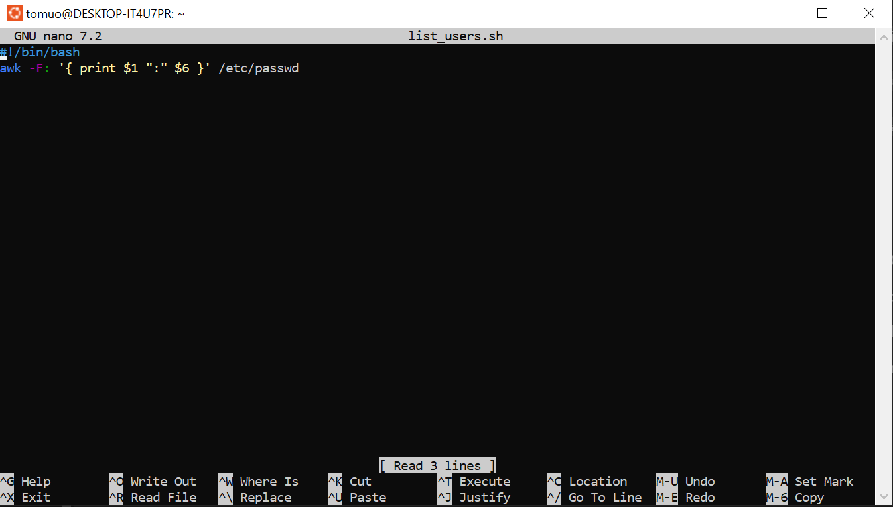
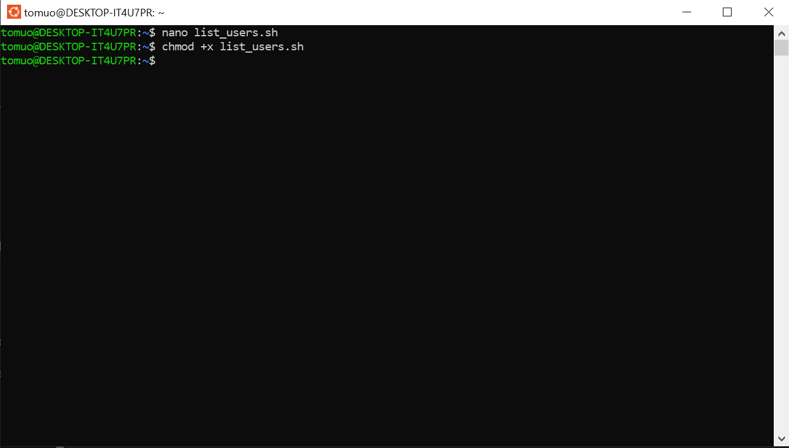
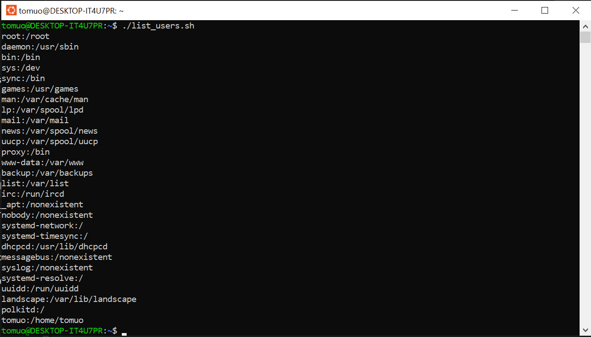

# GitLab-Associate-Support-Engineer-Assessment

**Part 1**

_Write a Ruby or Bash script that will print usernames of all users on a Linux system
   together with their home directories. Here's some example output:_

   ```
   gitlab:/home/gitlab
   nobody:/nonexistent
   .
   .
   ```
---
   # Step by Step   
   **How to List a username and directories in linux(WSL on windows)**

   ## 1. Open the Terminal

> Ctrl + alt + T for Linux users 


(_on windows and using WSL hit the windows key and type ubuntu_)

---
   ## Step 2: Create the Script with nano

   >nano list_users.sh



>When Nano opens you will see it has it's own menu. 




---

## Step 3: Add the Script Content 

Copy and paste or write this script into the nano

```
#!/bin/bash
awk -F: '{ print $1 ":" $6 }' /etc/passwd
```



This will select the two fields we are interested in $1 _(name)_ and $6 _(directory)_.

---

## Step 4: Save and Exit nano
>- Ctrl + O  press Enter to save

>- Ctrl + X to exit

---

## Step 5: Make the Script Executable
In order to allow the script to run you need to make it executable. Otherwise you will get "permission denied". 


```
chmod +x list_users.sh
```


---

## Step 6: Run the Script

now you can run the script and it should provide name and directories. 

```
./list_users.sh
```

---

## 🔗 References

1. **WSL Installation Guide – Microsoft Docs**  
   https://learn.microsoft.com/en-us/windows/wsl/install

2. **How to Print All Usernames on a System – GitHub**  
   https://github.com/rio197/How_to_print_all_usernames_on_system/tree/main

3. **Linux File Permissions Explained – Warp.dev**  
   https://www.warp.dev/terminus/linux-file-permissions-explained

4. **`passwd` File Manual – man7.org**  
   https://man7.org/linux/man-pages/man5/passwd.5.html

5. **ExplainShell – Command Explanation Tool**  
   https://explainshell.com/

6. **Google Searches**  
   - “how to run Linux scripts on Windows”  
   - “how to print usernames and directories”  
   *(Used for initial setup and command discovery)*

7. **ChatGPT – Prompted for Guidance**  
   - Prompted: *“I'm going through the assessment for GitLab. I will be citing this as my first use of AI but all I want you to do is list the questions.”*  
   *(Used to help structure task breakdown)*

8. **Peer Support – Linux Guidance**  
   A friend recommended the following resources:
   - [Linux File Permissions – Warp.dev](https://www.warp.dev/terminus/linux-file-permissions-explained)
   - [Package Management Basics – DigitalOcean](https://www.digitalocean.com/community/tutorials/package-management-basics-apt-yum-dnf-pkg)
   - [Process Management in Linux – DigitalOcean](https://www.digitalocean.com/community/tutorials/how-to-use-ps-kill-and-nice-to-manage-processes-in-linux)
   - [Basic Network Utilities – Dev.to](https://dev.to/sachindra149/basic-network-utilities-1e9l)
   
   