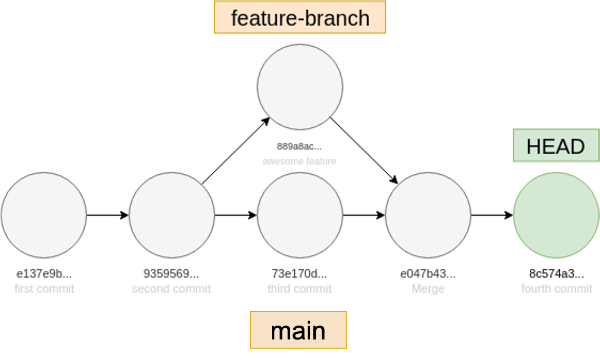

# GitLab-Associate-Support-Engineer-Assessment

# Question #1

## _Write a Ruby or Bash script that will print usernames of all users on a Linux system together with their home directories. Here's some example output:_

   ```
   gitlab:/home/gitlab
   nobody:/nonexistent
   .
   .
   ```
---
   # Step by Step   
   **How to List a username and directories in linux(WSL on windows)**

   ## 1. Open the Terminal

> Ctrl + alt + T for Linux users 


(_on windows and using WSL hit the windows key and type ubuntu_)

---
   ## Step 2: Create the Script with nano

   >nano list_users.sh


>When Nano opens you will see it has a menu. 


---

## Step 3: Add the Script Content 

Copy and paste or write this script into the nano

```
#!/bin/bash
awk -F: '{ print $1 ":" $6 }' /etc/passwd
```


This will select the two fields we are interested in $1 _(name)_ and $6 _(directory)_.

---

## Step 4: Save and Exit nano
>- Ctrl + O  press Enter to save

>- Ctrl + X to exit

---

## Step 5: Make the Script Executable
In order to allow the script to run you need to make it executable. Otherwise you will get "permission denied". 


```
chmod +x list_users.sh
```


---

## Step 6: Run the Script

now you can run the script and it should provide name(s) and directories. 

```
./list_users.sh
```

---


# Question #2

## _We have sent you an image named `git_history.v3.png` showing a Git commit graph. What sequence of Git commands could have produced the commit graph depicted in the image?_



---

💡 **Note:**  
In most of my day-to-day projects, I work with Git and GitHub through the VS Code interface.  
I often use pull requests to merge branches and review code, which typically triggers checks or formatting tools if they're configured in the repo.

For this question, I referred to the [IONOS Git Cheat Sheet](https://www.ionos.co.uk/digitalguide/websites/web-development/git-cheat-sheet/) to confirm the merge commands.

---
So the commands I assume for this history would be 

### 1. Init and first commit
>git init
git add .
git commit -m "first commit"

### 2. Second commit
>git add .
git commit -m "second commit"

### 3. Create feature branch from here
>git checkout -b awesome-feature

 - still on awesome-feature branch

### 4. Go back to main before third commit
>git checkout main

### 5. Third commit on main
>git add .
git commit -m "third commit"

### 6. Back to feature branch
>git checkout awesome-feature

### 7. Commit on feature branch
>git add .
git commit -m "awesome feature"

### 8. Merge feature branch into main
>git checkout main
git merge awesome-feature

### 9. One more commit on main
>git add .
git commit -m "fourth commit"

---


# Question #3

## _Write a brief blog post for GitLab that explains what Git is and what it can do for you. (Note: This is just a scenario for you to demonstrate your written skills and ability to explain technical topics. We are not using these assessments for anything other than the recruitment process)._


## Hey, I’m Tom 👋 I'm a developer, I enjoy making things that solve problems and help others. I'm all about user-friendly experiences.  So today I hope to do just that — I'm writing a short blog post for [GitLab](https://gitlab.com) all about Git.  

### What is GIT — What does it actually do for you?

Git is a tool, it does something called version control. I remember the first time I heard that phrase. One vague word leading to a vague explanation, don't worry I'm going to help you.

So let’s break it down.

---

## What is Version Control?

Version control is a way of tracking and managing changes in coding projects.

>_Maybe you read or perhaps you play video games. 
You can use a bookmark to save your place in a book and if you are a true 90's kid like me you would use a save point in the game._ 

Git lets you:
- Save your progress
- Go back to earlier versions
- Collaborate with others without stepping on each other’s toes


Imagine a team working together on a piece of software. To keep things stable, they don’t all edit the same copy of the code. Instead, they each create a **branch** — a separate version of the project — to work on specific features.

Once a feature is ready, they submit it for review. If everything looks good, it’s **merged** into the main branch — the stable version of the code.

---

## Why It Matters

Mistakes happen. That’s normal. This is all part of the learning process when it comes to working in a team. You will find that something may work on your machine that after pushing causes a merging error. Usually it's not a big issue and can be resolved at the point of merging.

Other times it can be something after the merge has taken place. Luckily your working with version control so you can revert or turn back the clock to a working version and hopefully figure out what the bug was. 


With Git, you can trace exactly what changed, when, and who did it. You can fix issues or roll back to a working version — without disrupting the whole team. 

---

## So What Does Git Do for You?

It gives you:
- Confidence to experiment
- A safety net when things go wrong
- A timeline of every step you and your team take


So when I say *Git is a version control tool*, I hope it now means something more useful than it did the first time you heard it.


---
# Question #4

## _Tell us about a recent issue you debugged or a problem you solved. How did you go about debugging it? What tools did you use? What was the outcome?_


### ⭐ Situation:
I was building a Chrome extension called **Site Read**, designed to make web content easier to read for neurodiverse users. The core feature boldens the first half of each word — a bionic reading effect — to help with focus and comprehension.

The extension worked well initially, but I noticed it was stripping out punctuation entirely. This made paragraphs harder to read and changed the tone of sentences.

---

### 🎯 Task:
I needed to preserve standard punctuation like periods, commas, and quotation marks while still applying the formatting effect to the correct parts of each word.

---

### 🛠️ Action:
Initially, I had written a basic function that only handled letters and numbers. I realized this wasn’t enough, so I modified the `keepSpacing` function to allow punctuation. I had written out a long winded way of doing it and showed my mentor. 

With guidance from my mentor, I began exploring **Regular Expressions (RegEx)** — something I hadn’t used deeply before. I updated the function to explicitly allow key punctuation characters using RegEx:

```js
function keepSpacing(word) {
  return word.replace(/[^\w\s.,!?'"“”‘’—–-]/g, '');
}
module.exports = keepSpacing;

```

The other part of the debugging process involved adding unit tests. I broke the main script into smaller modules, each in its own folder, so I could import and test them individually. 

I created unit tests for each and made sure they worked and this helped me make sure everything worked as expected. 

### 🎉 Result: 

Using folders for each part made things faster to edit and change. A cleaner and easier to read main contentScript.
I have a working Minimum Viable Product (MVP) that covers most written language and as I test it I can always perform fixes on the fly. 


## 🔗 References

1. **WSL Installation Guide – Microsoft Docs**  
   https://learn.microsoft.com/en-us/windows/wsl/install

2. **How to Print All Usernames on a System – GitHub**  
   https://github.com/rio197/How_to_print_all_usernames_on_system/tree/main

3. **Linux File Permissions Explained – Warp.dev**  
   https://www.warp.dev/terminus/linux-file-permissions-explained

4. **`passwd` File Manual – man7.org**  
   https://man7.org/linux/man-pages/man5/passwd.5.html

5. **ExplainShell – Command Explanation Tool**  
   https://explainshell.com/

6. **Google Searches**  
   - “how to run Linux scripts on Windows”  
   - “how to print usernames and directories”  
   *(Used for initial setup and command discovery)*
   - Git cheat sheets 
   - How to make a step-by-step guide for non technical people.  
   
7. **Markdown reference site**
   - https://stackedit.io/app#

8. **ChatGPT – Prompted for Guidance**  
   - Prompted: *“I'm going through the assessment for GitLab. I will be citing this as my first use of AI but all I want you to do is list the questions.”*  
   *(Used to help structure task breakdown)*

   - Q1: 
      - I have found some informations on scripts for linux and eve this github with some code suggested can you point me to some sites or reference material that might cover this in more detail.

      - I don't like trusting random code I've found online is there anywhere I can test this or find out what this does similar to RegExr would be good. 

      - For non-technical people some of the wording used on ExplainShell would be too much and not actually helpful.

      - I've gone through the site explanations and I want to know how my explaination sounds do you think I should add a note for windows users? 
   
   - Q2:

      - This is how I see this image. I think these would be the git commands. Did I miss anything? 

   
   - Q3:
      - Can you check the that what I have written is simple for non technical, you can suggest ways to improve it but I don't want a rewrite.

      - What is good size for image for the blog I want to convert them all to a standard size.
      
      - What’s the best image size for a blog banner? 

   - Q4:
      - Is what I have written clear enough? I'm using the star method 
      
      - This ``` usually allow for a code block,What other Markdown code block styles are there?


9. **Peer Support – Linux Guidance**  
   A friend recommended the following resources:
   - [Linux File Permissions – Warp.dev](https://www.warp.dev/terminus/linux-file-permissions-explained)
   - [Package Management Basics – DigitalOcean](https://www.digitalocean.com/community/tutorials/package-management-basics-apt-yum-dnf-pkg)
   - [Process Management in Linux – DigitalOcean](https://www.digitalocean.com/community/tutorials/how-to-use-ps-kill-and-nice-to-manage-processes-in-linux)
   - [Basic Network Utilities – Dev.to](https://dev.to/sachindra149/basic-network-utilities-1e9l)

   Asked him to check my working out on Q2 to make sure I hadn't missed anything. 
   
 10.  **IONOS Git Cheat Sheet**  
   - (https://www.ionos.co.uk/digitalguide/websites/web-development/git-cheat-sheet/)
   *(Used to confirm Git command structure for commit graph task)*

11. **Youtube**
  
   - **Explaining Technical Information to Non-Technical People**
  (https://youtu.be/pGK2EuLXL7A?si=Xd06fb0r0_AfIjzS)

  - **How to write technical blog posts - talk by Quincy Larson**(https://youtu.be/YODPgBadj80?si=XIneIzcm8RXd8gyQ)


